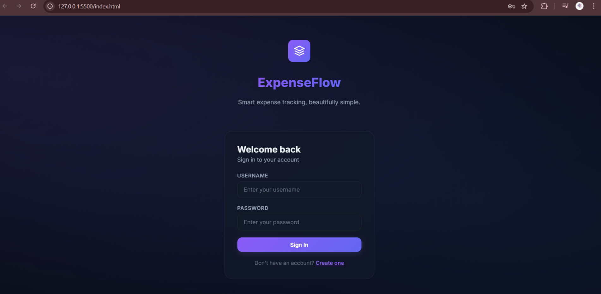
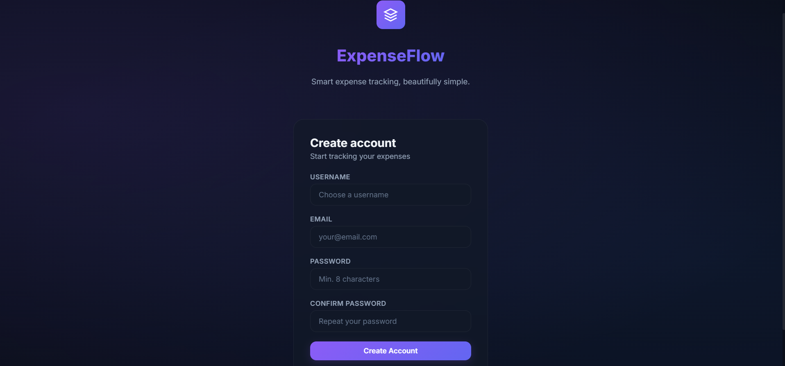
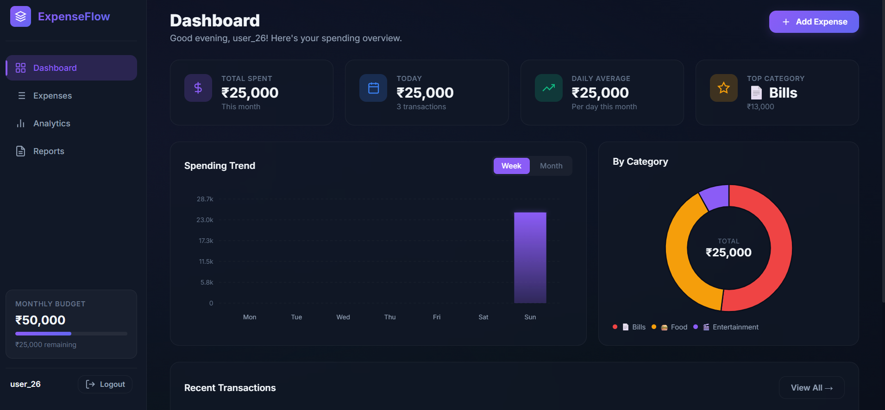
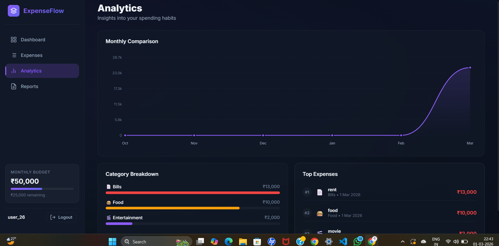
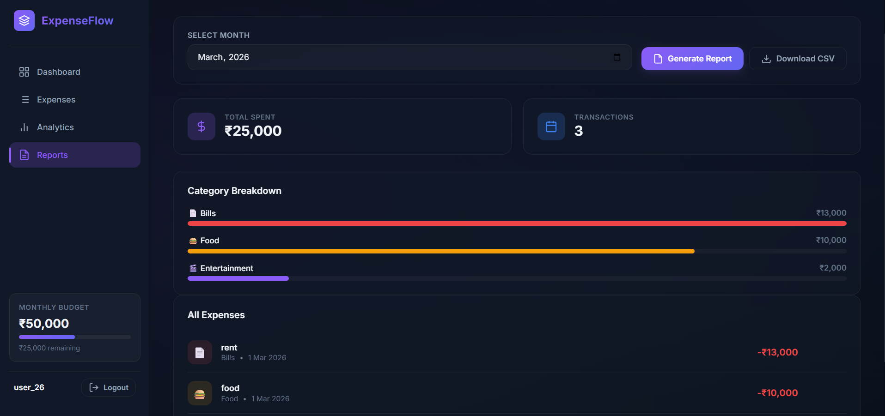

# 💰 Expense Tracker – Full Stack Application

A full-stack expense tracking application that allows users to securely manage personal expenses, categorize transactions, and generate monthly financial reports.

Built with **Django (backend)** and a lightweight frontend, following **REST API principles** and **secure data handling practices**, aligned with expectations of **European software engineering roles**.

---

## 🚀 Features

- User authentication (login & registration)
- Expense creation, update, and deletion
- Expense categorization
- Monthly expense reports
- CSV import for bulk expense uploads
- RESTful backend APIs
- Secure handling of user data

---

## 🛠️ Tech Stack

- **Backend:** Python, Django  
- **Database:** SQLite (development)  
- **Frontend:** HTML, CSS, JavaScript  
- **API Style:** REST (JSON)  
- **Version Control:** Git & GitHub  

---

## Live Demo
https://deepasree04.github.io/Expenses_Tracker/

---

## 📂 Project Structure
Expenses_Tracker/
│

├── backend/

│ ├── accounts/ # Authentication & user management

│ ├── expenses/ # Expense logic, categories & reports

│ ├── expensesflow/ # Django project configuration

│ ├── db.sqlite3 # Development database

│ └── manage.py

│

├── index.html # Frontend interface

├── app.js # Frontend logic

├── style.css # UI styling

└── README.md

---

## 🔐 Security & Data Handling

- Password hashing via Django authentication
- Auth-protected API endpoints
- Input validation for expense data and CSV uploads
- Secure handling of sensitive user information

---

## 🧪 Testing & Development

- Local development using SQLite
- Django admin panel for data inspection
- API testing using Postman or browser-based tools

---

## 📸 Screenshots

### 🔐 Authentication

### 📊 Dashboard & Analytics

### 📑 Reports

---
## 👤 Author

**Deepasree Somasundharam**  
Final Year BCA Student  
Aspiring Software Engineer 

---
